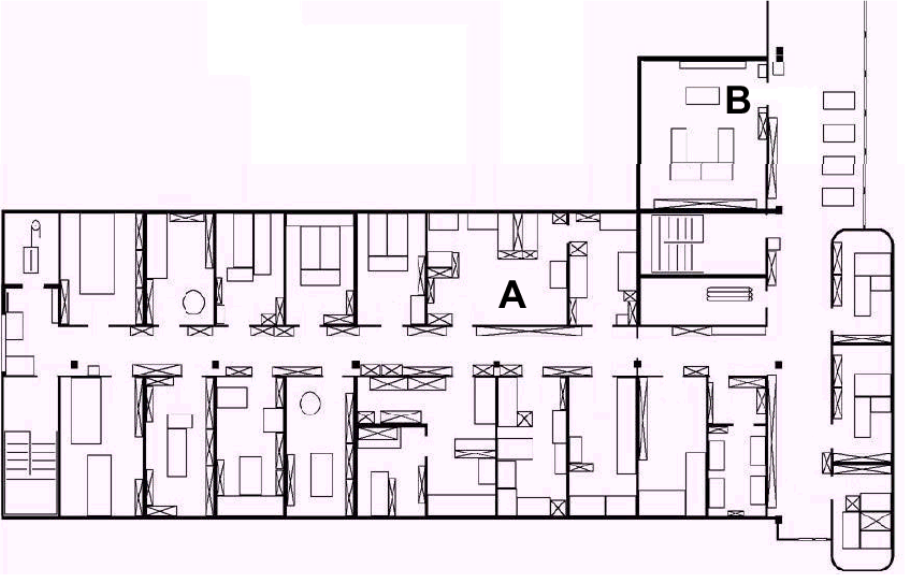

# CMPSC 311 Exam 1
# Name:


##### Note: The exam is open notes (printed or electronic) but closed to Internet searches.


### Question 1 [6 points]

Describe one property that can distinguish intelligent robot from other robot classifications?


### Question 2 [6 points]

Specify any two steps in the see-think-act cycle. Shortly describe what each of your selected steps is responsible for and give an appropriate example for each one.


### Question 3 [10 points (2 points each)]

1. Are wheel/motor sensors proprioceptive or exteroceptive? Briefly explain your reasoning.
2. Are gyroscope sensors active or passive? Briefly explain your reasoning.
3. Are GPS sensors proprioceptive or exteroceptive? Briefly explain your reasoning.
4. Are ultrasonic sensors active or passive? Briefly explain your reasoning.
5. Are doppler radars (motion/speed sensors that measure speed relative to fixed or moving objects) proprioceptive or exteroceptive? Briefly explain your reasoning.


### Question 4 [6 points]

How is the error of the sensor measured? Give a concrete formula and an example of applying the formula.


### Question 5 [6 points]

What is the goal of calibration? Provide an example (steps) of the calibration process for a sensor (you can use any sensor for your example).  


### Question 6 [5 points]

Describe a scenario where odometry-based localization may not be appropriate.


### Question 7 [5 points]

Describe a scenario where map-based localization may not be appropriate.


### Question 8 [10 points]

Consider the environment in the image below. Your robot begins room A and has a goal of stopping in the large room at position B. Design a sequence for a behavior-based robot to navigate successfully to B. Don't worry about the scale and the exact value of X if you use Turn X and Move X behaviors. \\

*Behaviors available are:*

LWF: left wall follow
RWF: right wall follow
HF: go down centerline of a hallway
Turn X: turn X degrees left/right
Move X: move X centimeters forward/backward
EnterD: center and enter through a doorway

*Termination conditions available are:*

DoorL: doorway on the left
DoorR: doorway on right
HallwayL: hallway intersection




### Question 9 [5 points]

Assuming that the Lego EV3 robot (programmed in leJOS) has a pen attached to it for drawing a line as it moves and given a code snippet below, what will be drawn by the robot (in a perfectly executed scenario) when it is finished with its navigation task?
Assume an instance of the `MovePilot` class, called `pilot` has already been declared and initialized:
```
...
pilot.travel(100);
pilot.rotate(90);
pilot.travel(100);
pilot.rotate(-90);
pilot.travel(200);
```


### Question 10 [6 points]

Given a code snippet below, explain what each of the five pose calls will (is supposed to) return.
```
OdometryPoseProvider opp = new OdometryPoseProvider(pilot);
opp.getPose(); // 1.
pilot.travel(100);
opp.getPose(); // 2.
pilot.rotate(90);
opp.getPose(); // 3.
pilot.travel(100);
opp.getPose(); // 4.
pilot.rotate(-90);
opp.getPose(); // 5.
```


### Question 11 [5 points]

What is the `SampleProvider` class in `leJOS` responsible for? Give a concrete example either in English or code.


### Question 12 [10 points]

1. What can `LinearCalibrationFilter` class do in leJOS? Give a concrete example either in English or code.
2. When is it appropriate to calibrate the sensors?


### Question 13 [10 points]

Write Java statements using leJOS API for the following navigation task, you can assume that the `MovePilot` and `EV3TouchSensor` objects have been defined as `pilot` and `touchSensor`:
* the robot travels straight for 50cm,  
* then after 100ms the robot  turns right  45 degrees,
* then the robot  travels straight 50cm,
* and finally it checks if the touch sensor has been triggered; if the touch sensor has been pushed,
the robot stops, makes a buzzing sound, travels straight backwards 50cm, and stops.


### Question 14 [10 points]

So far in this class you have read several articles touching on the issue of ethics
specific to robotics.
1. Describe two ways in which a robot can be compromised.
2. With your understanding of ethics, can an ethical robot be developed?
